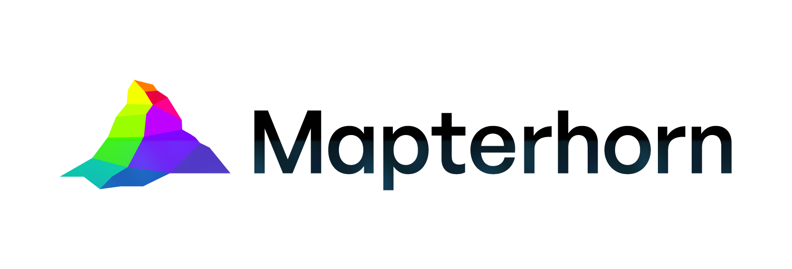

### About this `mapterhorn-bathymetry` fork

This fork is a (WIP) attempt to build a combined elevation + bathymetry model by adding GEBCO and other bathymetry datasets into the Mapterhorn pipeline. All credit goes to the [mapterhorn](https://github.com/mapterhorn/mapterhorn) team for their work so far! Use at your own risk.

#### About our Modifications

This branch keeps the upstream mapterhorn Justfile pipeline and adds:

- Optional source `domain` (`land` / `ocean` / `both` / `mask`) in `source-catalog/*/metadata.json`
- Shoreline masking (S2Coast + GSHHG Antarctica) during aggregation
- GEBCO as the global ocean source

Prepare the shoreline, then GEBCO, from `pipelines/`:

```
just ../source-catalog/s2coast/
just ../source-catalog/gebco/
```

See [source-catalog/README.md](./source-catalog/README.md) for `domain`, and [pipelines/README.md](./pipelines/README.md) for the rest of the pipeline.


---

<picture>
  <source media="(prefers-color-scheme: dark)" srcset="resources/mapterhorn-bathymetry-logo-darkmode.png">
  <source media="(prefers-color-scheme: light)" srcset="resources/mapterhorn-bathymetry-logo.png">
  
</picture>

Public terrain tiles for interactive web map visualizations.

## Viewer

[https://mapterhorn.com/viewer](https://mapterhorn.com/viewer)

## Examples

[https://mapterhorn.com/examples](https://mapterhorn.com/examples)

## Migrate from AWS Elevation Tiles (Tilezen Joerd)

```diff
"hillshadeSource": {
    "type": "raster-dem",
-   "tiles": ["https://elevation-tiles-prod.s3.amazonaws.com/terrarium/{z}/{x}/{y}.png"],
+   "tiles": ["https://tiles.mapterhorn.com/{z}/{x}/{y}.webp"],
    "encoding": "terrarium",
-   "tileSize": 256,
+   "tileSize": 512,
}

```

## Contributing

[CONTRIBUTING.md](./CONTRIBUTING.md)

## License

Code: BSD-3, see [LICENSE](https://github.com/mapterhorn/mapterhorn/blob/main/LICENSE).

Terrain data: various open-data sources, for a full list see [https://mapterhorn.com/attribution](https://mapterhorn.com/attribution).
